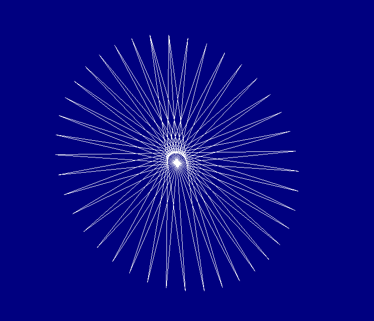
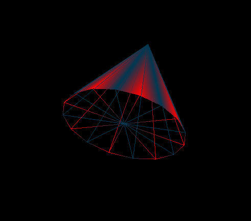
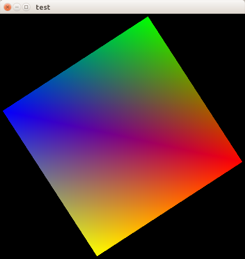

##实例图片


draw line
-----------------------------------
```c
static void draw_line()
{
    float x, y ,z, angle;

    //EE glBegin(GL_LINE_STRIP 经过所有点
    //EE glBegin(GL_LINE_LOOP 最后一个点会连接第一个点
    glBegin(GL_LINE_STRIP);
    {
        for (angle = 0; angle <= M_PI+0.3; angle+= (M_PI/20)) {
            // 圆的上半部分
            x = 50 * sin(angle);
            y = 50 * cos(angle);
            glVertex3f(x, y, z);


            // 圆的下半部分
            x = 50 * sin(angle + M_PI);
            y = 50 * cos(angle + M_PI);
            glVertex3f(x, y, z);
        }
    }glEnd();
}
```



draw triangle fan
--------------------------------------
```
//使用正方面分别设置为glPoylgon 
// glPolygonMode(GL_BACK, GL_LINE);
// glPolygonMode(GL_FRONT, GL_FILL);
来达到这种效果
static void draw_triangle_fan()
{
    //画锥形的面
    GLfloat c1[] = {.0, .0, 75.0};

    //画锥形的底
    GLfloat c2[] = {.0, .0, .0};

    _draw_triangle_fan(c1);
    _draw_triangle_fan(c2);
}
```




